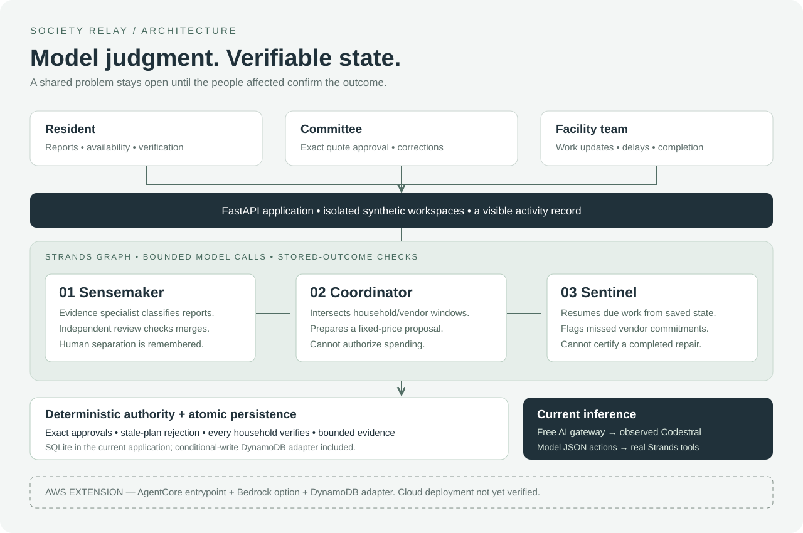

# Society Relay

**Report it once. Follow it through. Close it with the people affected.**

An apartment-society maintenance agent built with **Strands Agents SDK**, for the Agents for Humans hackathon's **Good Neighbor** track. Residents, committee members and facility teams share one incident lifecycle.

[Try the public interactive demo](https://relay.sarthakagrawal.dev/) · [Watch the public working-app demo (3:22)](https://youtu.be/s1T4McXs63M)

The live AWS preview uses Lambda, AgentCore, Amazon Nova Pro, and DynamoDB. Workspaces persist across web-process restarts; EventBridge Scheduler checks for due work every minute. AI usage is shared and limited. Use fictional data. [Deployment and usage limits](docs/aws-deployment-plan.md).

[Judge’s guide: story, decisions and evidence](docs/judges-guide.md)

## What works

- A three-stage **Strands Graph** runs Sensemaker, Coordinator and Sentinel. The live Bedrock path validates complete report partitions before linking. The optional gateway path also uses an independent model review.
- The coordinator intersects household and vendor availability with society quiet hours. A disappearing common window invalidates the old proposal; it cannot be approved by a stale browser.
- When no window works, the agent compares alternatives and requests a **one-visit access exception**. A resident can decline; Relay must consider a different household rather than repeat the request. Consent never changes general availability.
- Consent is bound to the household group, vendor, quote, date, and current constraints. Residents can withdraw it before authorization. A missed or disputed visit starts a fresh planning round, without carrying old consent onto the new date.
- Every stage has an inference limit. Stored outcomes, rather than a model's promises, determine whether the run completed.
- Committee approval is required for the exact proposal before creating a work order.
- Follow-up deadlines survive application restarts in DynamoDB. EventBridge Scheduler checks every minute; the optional local worker checks every 15 seconds. Failed agent runs pause automatic retries.
- Vendor completion is provisional: **every reporting household must verify restoration**. A resident can challenge a false completion.
- Atomic version checks prevent two concurrent approvals from creating duplicate work orders.
- Each browser gets an isolated synthetic workspace. The app includes committee, resident and facility-team perspectives plus a tool-evidence view.
- Committee members can separate a mistaken match before authorization. This withdraws the proposal and records a durable instruction preventing automatic remerging.
- Approved visits produce downloadable calendar invitations and fixed-price work orders. These are explicitly labelled demonstration artifacts.
- The complete AWS deployment passed [live acceptance](docs/aws-live-acceptance.json): Nova Pro tool execution, human approval, resident-confirmed closure, isolated workspaces, and external scheduling. The [DynamoDB consistency proof](docs/aws-persistence-evidence.json) separately checks stale-write rejection and conflict retry.

This is a **synthetic demonstration**, not production apartment-management software. Role switching is intentionally available for judging; it is not authenticated resident identity. No real vendor communications, payments, bookings or emergency dispatch occur. Use fictional data only.

## Run the hosted-model version

Requires Python 3.11+ and [uv](https://docs.astral.sh/uv/). Supply a Free AI gateway credential through your process environment or secret manager as `GATEWAY_API_KEY`. Never commit it. The gateway is an existing external service; it is not part of this hackathon's new code and access is not guaranteed for every developer.

```sh
uv sync --frozen
RELAY_MODEL_PROVIDER=gateway uv run uvicorn relay.app:app --host 127.0.0.1 --port 8765
```

The adapter requests the gateway's high reasoning tier and records the model actually returned. The recorded local configuration used Codestral. The hosted acceptance run used GPT-OSS-120B through the gateway. Because this gateway strips native tool-call history fields, `relay/gateway.py` translates model-authored JSON actions into Strands tool-use events. **Strands executes the real tools**; the adapter does not fabricate results. Backend policy remains authoritative. Provider availability and free quotas can change.

## Optional local inference

Requires Python 3.11+, [uv](https://docs.astral.sh/uv/), and [Ollama](https://ollama.com/). Model downloads consume local disk and bandwidth; inference uses your computer.

```sh
uv sync --frozen
ollama serve
# In another terminal:
ollama pull qwen3:4b
uv run uvicorn relay.app:app --host 127.0.0.1 --port 8765
```

Open `http://127.0.0.1:8765`. Select **Try the water-supply example**. The example creates two fictional reports and starts the actual Strands agent. Small local models can be slow or make tool errors; inspect **Activity & evidence** and retry when needed. Completed tool actions are preserved.

### Five-minute test route

1. Load the example. Relay should link the reports and prepare a ₹1,800 proposal.
2. Try **The only shared window disappears**; approval becomes unavailable. Relay proposes a one-time exception. As **Resident**, decline it. Watch the agent propose a plan involving the other household; accept that visit. General availability stays unchanged. Approve the current plan as **Committee**.
3. As **Facility team**, report a delay. The background worker brings the missed milestone to the committee. Choose **Prepare the next visit**, obtain fresh consent if needed, and approve the new dated proposal.
4. As **Facility team**, describe the repair and report work complete.
5. As **Resident**, challenge the completion with **The issue is still happening**. The issue returns to human attention. After a revised visit and a new completion report, confirm A-304. It remains open until A-502 confirms too.
6. Inspect the activity record and actual tool calls.

An explicitly labelled deterministic mode is available for workflow development:

```sh
RELAY_MODEL_PROVIDER=fixture uv run uvicorn relay.app:app --port 8765
```

Fixture mode does not perform semantic report linking and is **not evidence of AI functionality**.

## Architecture



`relay/agent.py` owns the Strands tools and inference budget. `relay/domain.py` owns lifecycle authority. `relay/store.py` commits workspace changes atomically. `relay/app.py` serves the interface and local scheduler. `relay/agentcore.py` wraps the same agent for AgentCore.

### AWS path

The deployed AWS route uses a public Lambda Function URL for FastAPI, a private Lambda invocation bridge, IAM-authenticated AgentCore, Amazon Nova Pro, DynamoDB, and EventBridge Scheduler. The first live coordination run took 10.33 seconds. A second workspace completed through the external scheduler without a manual agent request. See [AWS deployment notes](docs/aws.md) and [acceptance evidence](docs/aws-live-acceptance.json).

## Validation

```sh
uv run pytest -q
uv run ruff check relay tests scripts
node --check relay/static/app.js
```

The tests cover authorization boundaries, stale approvals, concurrency, private-report separation, missed milestones, false completion, report retries, correction persistence, transport compatibility and workspace isolation.

Real-model acceptance cases are recorded in `docs/evaluations/`. These are bounded synthetic cases, not a general accuracy claim. Run a case with a gateway credential supplied to the process:

```sh
uv run python -m scripts.evaluate_agent --case duplicates
uv run python -m scripts.evaluate_agent --case unrelated
uv run python -m scripts.evaluate_agent --case injection
uv run python -m scripts.evaluate_agent --case no-window
uv run python -m scripts.evaluate_agent --case delay
uv run python -m scripts.evaluate_agent --case consent
```

Each result includes explicit checks, actual tool calls, observed model names, duration and final persisted state. A failed check is recorded as a failure.

Earlier validation passed 50 deterministic tests and six targeted live-model cases; the current check counts and frozen benchmark appear below. Two separate hosted end-to-end runs passed (71.28s and 53.18s for AI coordination); both then verified exact proposal approval and closure only after both households confirmed. The later requested-model configuration is recorded in [hosted acceptance evidence](docs/hosted-pinned-acceptance.json). Intermittent provider failures were also observed and retained in [failed hosted checks](docs/hosted-pinned-verification.json); these successes are not an uptime guarantee. The consent case contains two actual model runs separated by a resident refusal; it checks that the next request involves a different household, the quote stays fixed, and general availability remains unchanged.

## Scope and limitations

- The current user study is not complete. No measured resident time savings or adoption claims are made.
- This demo caps each workspace at 35 incidents and 300 KB, retaining recent audit events and agent runs. It is not an archival ledger.
- Local SQLite survives process restart, not machine loss. An ephemeral host may lose its disk. DynamoDB is required for the AgentCore route.
- The AWS scheduler and private runtime bridge are deployed and verified. Production identity integration is not implemented; the role chooser remains a synthetic demonstration.
- Semantic classification can be wrong; the optional gateway review can also be wrong. Original reports remain visible; human separation is available before work is authorized. This is not proof of physical root cause.
- Real society operation needs authenticated roles, resident consent, scoped integrations, reliable notification delivery and an operational incident-retention policy.
- Access requests currently appear inside the synthetic workspace. They are not sent to real residents. Refusals stop repeated requests within the current planning round; a deliberately revised visit has a new date and requires new consent. There is no automatic consent timeout or external notification delivery yet.
- This is not an emergency-response service.

## Attribution and build disclosure

New application code and original CSS/SVG interface were created on September 9–10, 2026. Development used an AI coding assistant (OpenAI Codex). No existing Fleet or client application code was incorporated. Dependencies are recorded in `uv.lock`; their licenses remain their own. The optional Qwen model is distributed separately by its upstream provider and is not relicensed by this repository.

MIT license. Copyright Sarthak Agrawal.

## Try the difficult repair

Choose **Start the difficult repair** on the [live community desk](https://relay.sarthakagrawal.dev/). The guide walks through a refusal, an alternative access agreement, a missed visit, fresh consent, and separate household confirmations. It follows actual saved state and never simulates successful model decisions.

For an immediate evidence walkthrough, [replay the verified AWS run](https://relay.sarthakagrawal.dev/static/repair.html). Fifteen checkpoints expose the decisions and their state changes. Five real Nova Pro runs completed this journey; the original ₹1,800 quote and household availability stayed unchanged. Source: [difficult-repair-evidence.json](docs/difficult-repair-evidence.json).

## Frozen challenge evaluation (10 September 2026)

[Eight-case benchmark, three rules baselines, raw failures and full-workflow follow-up](docs/evaluations/challenge-v1/README.md). Nova and each baseline scored 6/8 on the first pass; both failed component cases passed separately through the complete workflow. Added provider-fault, concurrent-response and stale-consent checks. 55 Python and 6 JavaScript checks pass.

[Current AWS demonstration](https://youtu.be/s1T4McXs63M) — 3:22, captured on 10 September. Includes refusal, missed-visit recovery, fresh consent and separate resident confirmations.
